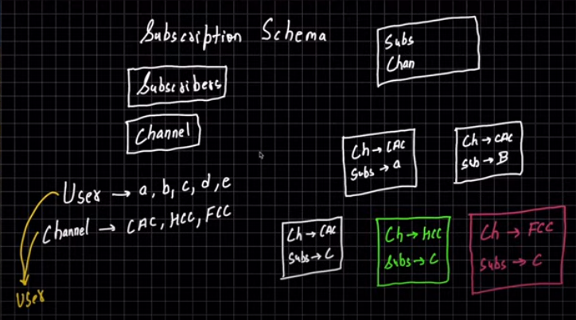

# Understand the Subscription Schema

## *Understanding Subscription Schema*
- As we can see inside the user schema there are storing subscriber and channel, they both are users. 
- Now a user subscribes to a channel, then a document will create. Inside the document channel and the subscriber will be stored.
- Now another user subscribes to a channel, then again a document will create. Inside the document channel and the subscriber will be stored.
- So whenever a user will subscribe to any channel a new document will be created.
- Now if we want to calculate the subscribers of a channel 'x', then we will count the number of documents with the channel name 'x'.
- Now if user 'y' wants to know how many channels he/she is subscribed, then we will count the number of documents with the subscriber name 'y'.
- 